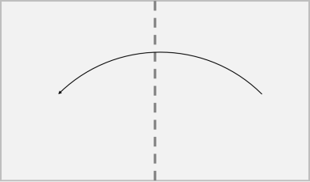
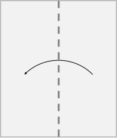
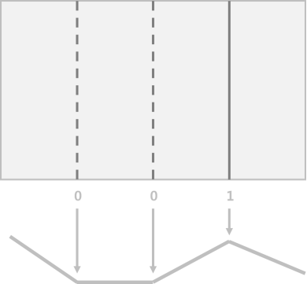
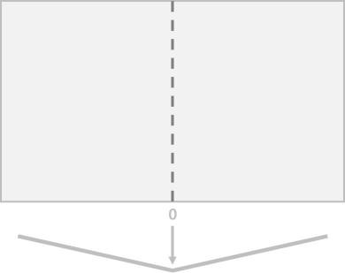
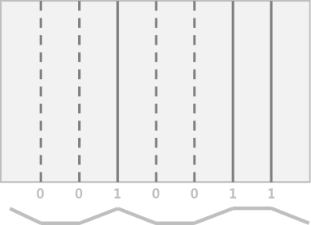

# 종이접기

## 문제 풀이

~~~javascript
function solution (n) {
    let answer = [];
    let strAnswer = '0';
    
    // 한번 접힌 굴곡의 좌우로 0, 1의 굴곡이 추가로 생긴다.
    // n번을 반복하면서 기존 굴곡 사이사이에 0, 1 를 끼워넣어주고 마지막에 문자열을 배열 형태로 split 한다.
    // 처음엔 배열에 끼워넣었으나 시간이 너무 오래걸려 문자열로 적용 후 마지막에 배열로 변환한다.
    while (n > 1) {
        let temp = '';
        let direction = 0;
        
        for (let i = 0; i < strAnswer.length; i++) {
            temp += (direction + strAnswer[i]) ;
            direction = direction === 0 ? 1 : 0;
        }
        temp += 1;
        strAnswer = temp;
        
        n--;
    }
    
    answer = strAnswer.split('');
    for (let i = 0; i < answer.length; i++) {
        answer[i] = parseInt(answer[i]);
    }
    
    return answer;
}
~~~

 

## 문제 설명    

직사각형 종이를 n번 접으려고 합니다. 이때, 항상 오른쪽 절반을 왼쪽으로 접어 나갑니다. 다음은 n = 2인 경우의 예시입니다.

먼저 오른쪽 절반을 왼쪽으로 접습니다.

다시 오른쪽 절반을 왼쪽으로 접습니다.

종이를 모두 접은 후에는 종이를 전부 펼칩니다. 종이를 펼칠 때는 종이를 접은 방법의 역순으로 펼쳐서 처음 놓여있던 때와 같은 상태가 되도록 합니다. 위와 같이 두 번 접은 후 종이를 펼치면 아래 그림과 같이 종이에 접은 흔적이 생기게 됩니다.

위 그림에서 ∨ 모양이 생긴 부분은 점선(0)으로, ∧ 모양이 생긴 부분은 실선(1)으로 표시했습니다.

종이를 접은 횟수 n이 매개변수로 주어질 때, 종이를 절반씩 n번 접은 후 모두 펼쳤을 때 생기는 접힌 부분의 모양을 배열에 담아 return 하도록 solution 함수를 완성해주세요.

 

### 제한사항  

- 종이를 접는 횟수 n은 1 이상 20 이하의 자연수입니다.
- 종이를 접었다 편 후 생긴 굴곡이 ∨ 모양이면 0, ∧ 모양이면 1로 나타냅니다.
- 가장 왼쪽의 굴곡 모양부터 순서대로 배열에 담아 return 해주세요.

 

### 입출력 예

|n|result|
|---|---|
|1|[0]|
|2|[0,0,1]|
|3|[0,0,1,0,0,1,1]|

 

### 입출력 예 설명  

입출력 예 #1 
종이의 오른쪽 절반을 왼쪽으로 한번 접었다 펴면 아래 그림과 같이 굴곡이 생깁니다.

따라서 [0]을 return 하면 됩니다.

입출력 예 #2
문제의 예시와 같습니다.

입출력 예 #3
종이를 절반씩 세 번 접은 후 다시 펼치면 아래 그림과 같이 굴곡이 생깁니다.

따라서 [0,0,1,0,0,1,1]을 return 하면 됩니다.

 

**출처: 프로그래머스 코딩 테스트 연습, https://programmers.co.kr/learn/challenges.**